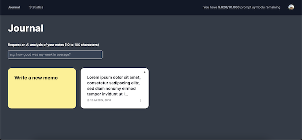
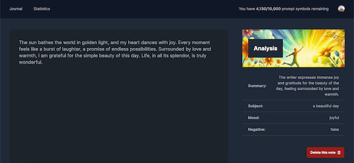
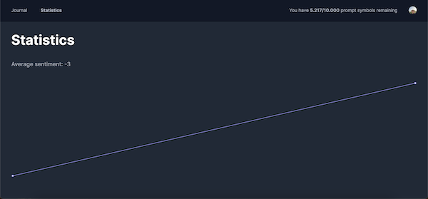

# NextJS OpenAI Integration Demo

This demo application, built with NextJS, TypeScript, Tailwind, Clerk, Prisma, and OpenAI, allows users to dynamically analyze their mood based on journal entries. The AI interprets users’ thoughts and generates mood statistics, displayed in detailed charts.

## Project Description

NextJS OpenAI Integration Demo is designed to showcase the integration of various modern web technologies to create an AI-powered mood analysis tool.

### Features

- AI-powered mood analysis from journal entries
- Detailed mood statistics displayed in charts
- User authentication and management with Clerk
- Integration with Prisma for database management

### Notable Libraries and Technologies

- **NextJS**: The React framework for production.
- **TypeScript**: A typed superset of JavaScript that compiles to plain JavaScript.
- **TailwindCSS**: A utility-first CSS framework for rapidly building custom user interfaces.
- **Clerk**: User management, authentication, and access control.
- **Prisma**: Next-generation ORM for Node.js and TypeScript.
- **OpenAI**: AI tools and models for natural language processing.

## Table of Contents

- [Installation](#installation)
- [Usage](#usage)
- [Scripts](#scripts)
- [Dependencies](#dependencies)
- [Dev Dependencies](#dev-dependencies)
- [Author](#author)
- [License](#license)
- [TODO](#todo)

## Installation

1. Clone the repository:
   `git clone https://github.com/yourusername/nextjs-openai-integration-demo.git`
2. Navigate to the project directory:
   `cd nextjs-openai-integration-demo`
3. Install the dependencies:
   `yarn install`

## Usage

To start the development server, run:
`yarn run dev`

To build the project for production, run:
`yarn run build`

To start the production server, run:
`yarn run start`

## Scripts

- `dev`: Starts the NextJS development server.
- `build`: Builds the project for production using NextJS.
- `start`: Starts the NextJS production server.
- `lint`: Lints the code using ESLint.
- `test`: Runs tests using Vitest with coverage.
- `format`: Formats the code using Prettier.
- `type-check`: Checks TypeScript types.
- `db:push`: Pushes the Prisma schema state to the database.
- `db:format`: Formats the Prisma schema.

## Dependencies

- `@clerk/nextjs`: ^5.1.6
- `@langchain/core`: ^0.2.10
- `@langchain/openai`: ^0.2.0
- `@neondatabase/serverless`: ^0.9.3
- `@prisma/adapter-neon`: ^5.16.0
- `@prisma/client`: ^5.16.0
- `@radix-ui/react-dropdown-menu`: ^2.1.1
- `langchain`: ^0.2.7
- `lodash`: ^4.17.21
- `nanoid`: ^5.0.7
- `next`: 14.2.4
- `react`: ^18
- `react-autosave`: ^0.4.4
- `react-dom`: ^18
- `recharts`: ^2.13.0-alpha.4
- `ws`: ^8.17.1
- `zod`: ^3.23.8

## Dev Dependencies

- `@commitlint/cli`: ^19.3.0
- `@commitlint/config-conventional`: ^19.2.2
- `@testing-library/react`: ^16.0.0
- `@types/lodash`: ^4.17.6
- `@types/node`: ^20
- `@types/react`: ^18
- `@types/react-dom`: ^18
- `@types/ws`: ^8.5.10
- `@typescript-eslint/eslint-plugin`: ^7.14.1
- `@vitejs/plugin-react`: ^4.3.1
- `@vitest/coverage-v8`: ^1.6.0
- `daisyui`: ^4.12.10
- `eslint`: ^8
- `eslint-config-airbnb-typescript`: 16.0.0
- `eslint-config-next`: 14.2.4
- `eslint-config-node`: 4.1.0
- `eslint-config-prettier`: 8.0.0
- `eslint-import-resolver-typescript`: 3.6.1
- `eslint-plugin-deprecation`: 2.0.0
- `eslint-plugin-import`: 2.25.2
- `eslint-plugin-jest-dom`: 5.4.0
- `eslint-plugin-jsx-a11y`: 6.7.0
- `eslint-plugin-node`: 11.1.0
- `eslint-plugin-package-json`: 0.12.0
- `eslint-plugin-prettier`: 5.1.3
- `eslint-plugin-react`: 7.28.0
- `eslint-plugin-testing-library`: 6.2.2
- `husky`: ^9.0.11
- `jsdom`: ^24.1.0
- `postcss`: ^8
- `prettier`: ^3.3.2
- `prettier-plugin-tailwindcss`: ^0.6.5
- `prisma`: ^5.16.0
- `react-icons`: ^5.2.1
- `tailwindcss`: ^3.4.1
- `typescript`: ^5
- `vitest`: ^1.6.0

## Author

Oleksii Suprun  
Email: oleksii.suprun.email@gmail.com

## License

This project is licensed under the MIT License. See the [LICENSE](LICENSE) file for details.

## TODO

- [ ] Add unit & e2e tests
- [ ] Improve error handling in API requests
- [x] Enhance the user interface for better usability
- [ ] Implement i18n and German localization
